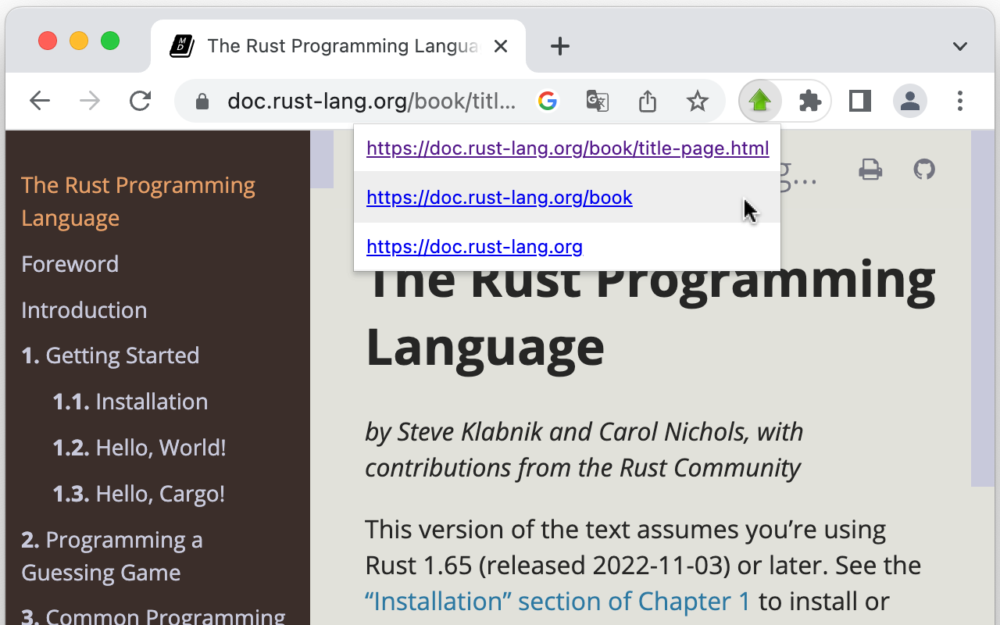

# 🚀 Go Up
This is a browser extension that jumps to the upper directories of the current URL.

## How to install

You can install from your browser extension store below.

- TBD
<!--
- [Chrome / Brave](https://chrome.google.com/webstore/detail/)
- [Firefox](https://addons.mozilla.org/ja/firefox/addon/)
- [Edge](https://microsoftedge.microsoft.com/addons/detail/)
-->

## Usage

1. Pin the extension icon to your browser's toolbar
1. Click the extension icon on the toolbar
1. The links of the upper directories of the current URL are displayed.
1. Click the displayed links to jump to those URLs.
