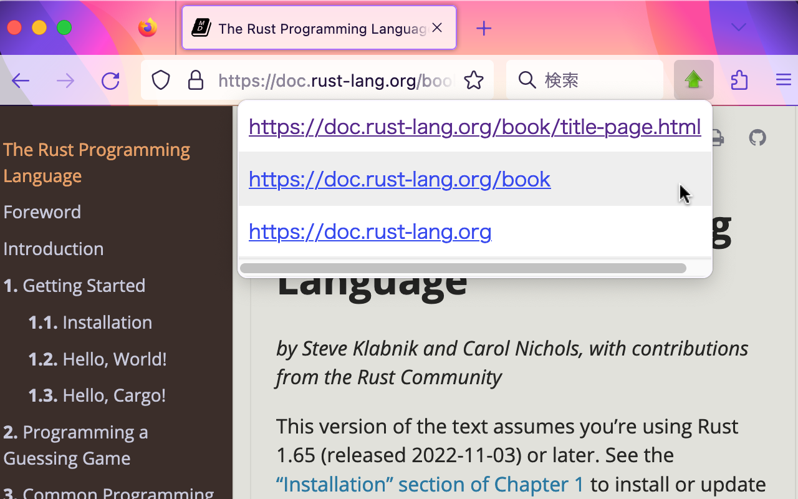
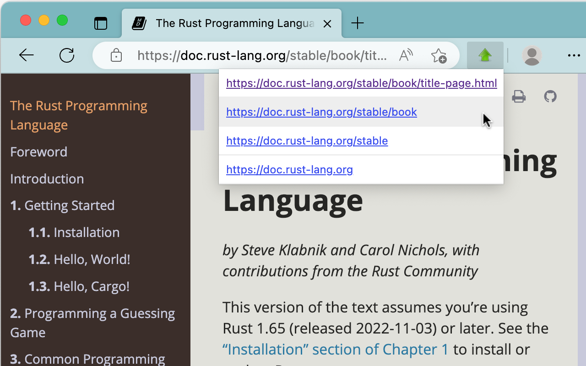

# 🚀 Go Up

**Go Up** is a browser extension that jumps to the upper directories of the current URL.

## How to Install

You can install the extension from your browser’s extension store:

- [Chrome / Brave](https://chrome.google.com/webstore/detail/go-up/obdfapiepknjcdapjicmcldjbnfjngej)
- [Firefox](https://addons.mozilla.org/en-US/firefox/addon/go-up/)
- [Edge](https://microsoftedge.microsoft.com/addons/detail/go-up/kfgedjcojfbflkgfnpnpibjfnenahfeo)

## Usage

1. Pin the extension icon to your browser's toolbar.
2. Click the extension icon on the toolbar to display the links of the upper directories of the current URL.
3. Click the displayed links to jump to those URLs. 

This is especially useful when navigating through file structures or documentation.

## Related Extensions

If you are looking for a more streamlined way to navigate to the parent directory, consider using **Go Up Key**, which allows you to jump to the parent directory using keyboard shortcuts.
