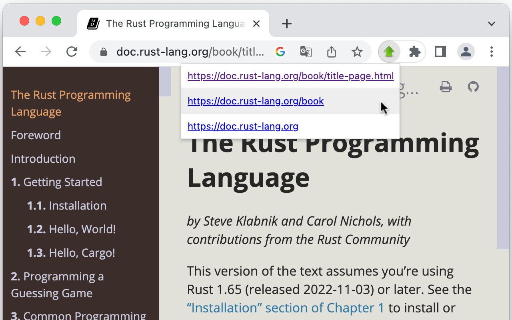

# 🚀 Go Up

**Go Up** は、現在のURLの上位ディレクトリにジャンプするブラウザ拡張機能です。

## インストール方法

お使いのブラウザの拡張機能ストアからインストールできます：

- [Chrome / Brave](https://chrome.google.com/webstore/detail/go-up/obdfapiepknjcdapjicmcldjbnfjngej)
- [Firefox](https://addons.mozilla.org/en-US/firefox/addon/go-up/)
- [Edge](https://microsoftedge.microsoft.com/addons/detail/go-up/kfgedjcojfbflkgfnpnpibjfnenahfeo)

## 使用方法

1. 拡張機能のアイコンをブラウザのツールバーにピン留めします。
2. ツールバーの拡張機能アイコンをクリックすると、現在のURLの上位ディレクトリへのリンクが表示されます。
3. 表示されたリンクをクリックすると、それらのURLにジャンプします。

これは、ファイル構造やドキュメントをナビゲートする際にとくに便利です。

## 関連する拡張機能

親ディレクトリへの移動をより簡単に行いたい場合は、キーボードショートカットでジャンプできる [Go Up Key](https://github.com/tomarint/go-up-key) も同時にインストールすると便利です。
